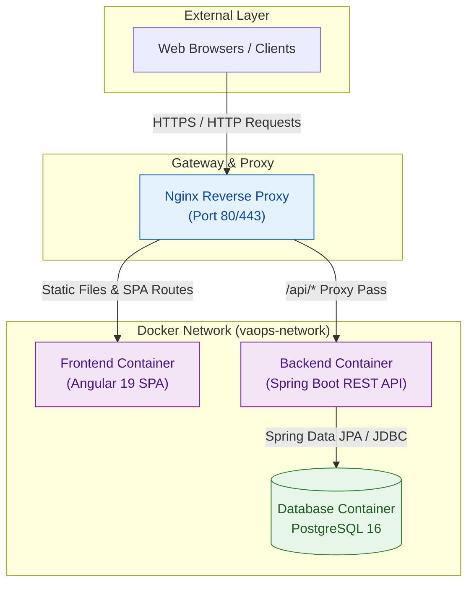
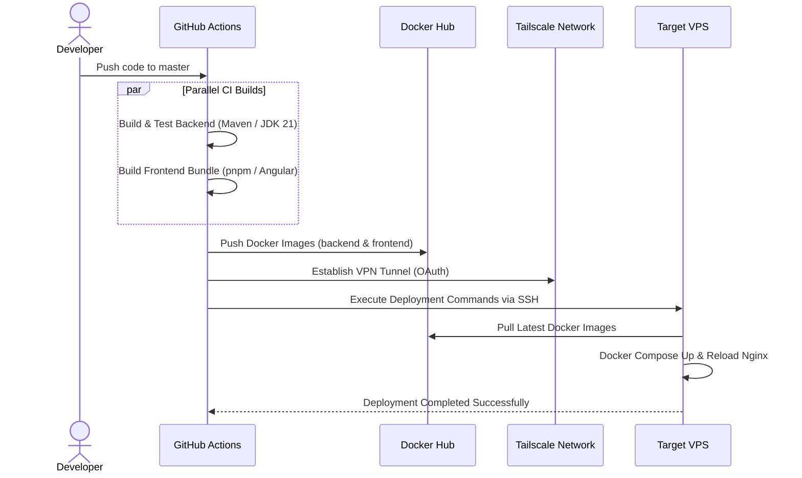

# VAOPS - Van Nang Operations & Data Management System

## Introduction

**VAOPS** (Van Nang Operations) is an internal operations & data management system custom-built for **Van Nang Mechanical Co., Ltd.** (Binh Duong, Vietnam).

While the existing SPA Marketing system ([Van Nang Mechanical - Landing Page](https://github.com/MaiTheHao/vaops-marketing-spa)) handles marketing campaigns and customer acquisition, **VAOPS** serves as a centralized platform for managing all production data, orders, clients, and providing integrated APIs/data feeds for the enterprise's marketing and administrative channels.

---

## System Architecture & Operating Model

The system follows a **Microservices-ready Monolith** design pattern, fully containerized via Docker and automatically deployed through a CI/CD pipeline infrastructure.



- **Reverse Proxy / SSL**: Nginx acts as the single entry point, reverse-proxying incoming requests to the Frontend SPA and Backend REST APIs.
- **Frontend Layer**: Single Page Application (SPA) built with Angular 19+, communicating asynchronously with the Backend via RESTful APIs.
- **Backend Layer**: Core business logic, session management, security, and database operations powered by Spring Boot 3 & Java 21.
- **Database Layer**: PostgreSQL database ensuring data integrity for all operational records.
- **Infrastructure & CI/CD**: Container management via Docker Compose, secure private networking via Tailscale VPN, and automated Build-Test-Deploy workflows via GitHub Actions.

---

## CI/CD Deployment Flow

Source code on the `master` branch is automatically tested, packaged, and deployed to the VPS host using GitHub Actions and a secure Tailscale VPN tunnel:



---

## Technology Stack

### Backend
- **Language & Runtime**: Java 21 (Temurin JDK)
- **Framework**: Spring Boot 3.4+
- **Build Tool**: Apache Maven (Wrapper `./mvnw`)
- **Database Access**: Spring Data JPA / Hibernate
- **Database**: PostgreSQL 16

### Frontend
- **Framework**: Angular 19+
- **Package Manager**: `pnpm` (v11)
- **Runtime**: Node.js 24
- **Styling & UI**: SCSS / Modern Modular CSS

### Infrastructure & Operations
- **Containerization**: Docker & Docker Compose
- **Reverse Proxy**: Nginx
- **VPN / Secure Connection**: Tailscale OAuth
- **CI/CD Pipeline**: GitHub Actions (`.github/workflows/`)
- **Deployment Host**: Linux VPS

---

## Repository Structure

```
vaops/
├── .github/
│   └── workflows/      # GitHub Actions CI/CD workflows (backend, frontend, infra)
├── backend/            # Spring Boot REST API source code (Java 21)
├── frontend/           # Angular SPA source code (Node 24, pnpm)
├── infra/
│   └── docker/         # Docker Compose (dev, prod) & Nginx configurations
├── docs/               # System design documentation & workflow guides
└── README.md
```

---

## Automated Deployment Pipelines

1. **Backend CI/CD** (`.github/workflows/backend-ci.yml`): Automatically runs tests, builds the JAR package, creates Docker images, pushes to Docker Hub, and triggers SSH deployment to the VPS.
2. **Frontend CI/CD** (`.github/workflows/frontend-cicd.yml`): Automatically builds the Angular distribution bundle, packages the Docker image, and deploys it to the VPS.
3. **Infra CI/CD** (`.github/workflows/infra-ci.yml`): Synchronizes Nginx configuration, Docker Compose files, and environment variables to the remote server over Tailscale VPN.

*For details on required deployment environment secrets, please refer to the [Workflows README](file:///.github/workflows/README.md).*

---

## Company Information & Contact

- **Company Name:** Van Nang Mechanical Co., Ltd. (Công Ty TNHH Cơ Khí Vạn Năng)
- **Tax ID:** 3703143102
- **Legal Representative:** MAI THANH TIEN
- **Registered Address:** No. 522, DT747 Road, Group 1, Quarter 8, Uyen Hung Ward, Tan Uyen City, Binh Duong Province, Vietnam
- **Primary Business:** Wholesale of machinery, equipment, and industrial spare parts (inverters, electric motors, control panels, circuit boards, CNC components)
- **Phone:** +84 944 432 430 (0944432430)
- **Email:** cokhivannang@gmail.com
- **Business Hours:** Monday - Saturday, 7:30 AM - 4:30 PM (ICT)

