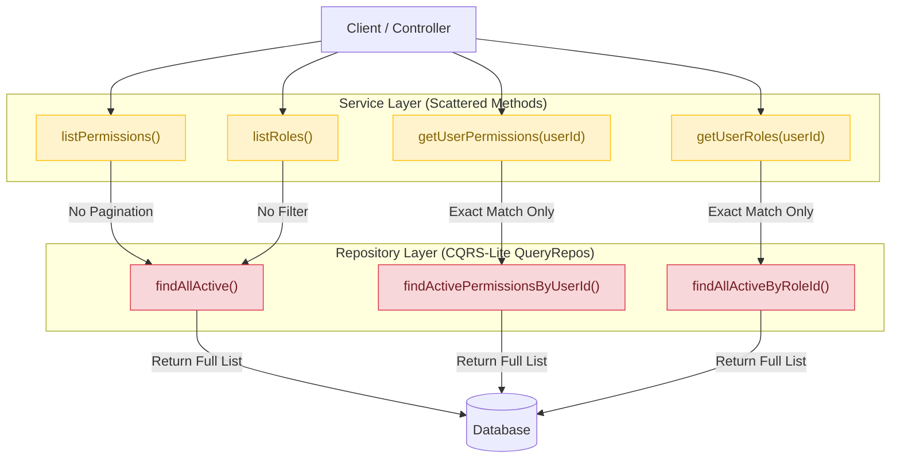
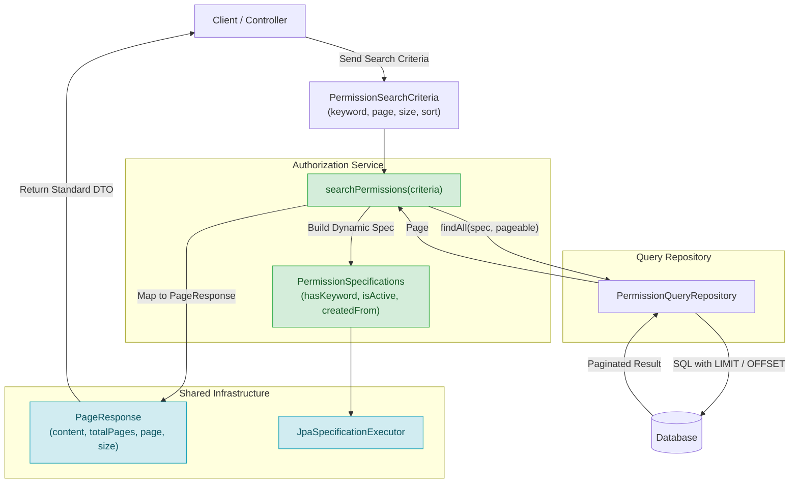

# Báo Cáo Phân Tích: Search/Filter/Pagination Patterns Trong Hệ Thống

## 1. Tổng Quan

Báo cáo này phân tích hiện trạng các module **authorization**, **identity**, và **authentication** trong dự án, tập trung vào:
- Các method phục vụ tìm kiếm (search), lọc (filter), liệt kê (list) domain entity
- Khả năng phân trang (pagination)
- Cơ sở hạ tầng dùng chung cho search/filter/pagination trong toàn bộ dự án

## 2. Phân Tích Chi Tiết Từng Module

### 2.1. Module Authorization

**Vị trí:** `backend/src/main/java/c4f/vannang/vaops/modules/authorization/`

#### Service Layer Methods

| Service | Method | Parameters | Return Type | Pagination | Filter |
|---|---|---|---|---|---|
| `PermissionService` | `listPermissions()` | *(none)* | `List<PermissionResponse>` | ❌ | ❌ (chỉ `isActive = true`) |
| `PermissionService` | `getUserPermissions(UUID userId)` | `userId` | `List<PermissionResponse>` | ❌ | userId (exact match) |
| `RoleService` | `listRoles()` | *(none)* | `List<RoleResponse>` | ❌ | ❌ (chỉ `isActive = true`) |
| `RoleService` | `getUserRoles(UUID userId)` | `userId` | `List<RoleResponse>` | ❌ | userId (exact match) |

#### Repository Layer Methods

| Repository | Method | Return Type | Pagination | Ghi chú |
|---|---|---|---|---|
| `PermissionQueryRepository` | `findAllActive()` | `List<Permission>` | ❌ | Trả về tất cả, không filter động |
| | `findActivePermissionsByRoleId(UUID)` | `List<Permission>` | ❌ | Chỉ filter bằng roleId |
| | `findActivePermissionsByUserId(UUID)` | `List<Permission>` | ❌ | Dùng JPQL join 3 bảng |
| | `findByResourceAndAction(String, String)` | `Optional<Permission>` | ❌ | Lookup chính xác |
| | `findAllActiveByIds(List<UUID>)` | `List<Permission>` | ❌ | Batch lookup |
| | `hasPermission(UUID, String, String)` | `boolean` | ❌ | Kiểm tra tồn tại |
| `RoleQueryRepository` | `findAllActive()` | `List<Role>` | ❌ | Trả về tất cả, không filter động |
| | `findActiveRolesByUserId(UUID)` | `List<Role>` | ❌ | Chỉ filter bằng userId |
| | `findByCode(String)` | `Optional<Role>` | ❌ | Lookup chính xác |
| | `findAllActiveByIds(List<UUID>)` | `List<Role>` | ❌ | Batch lookup |
| `UserRoleQueryRepository` | `findAllByUserId(UUID)` | `List<UserRole>` | ❌ | Chỉ filter userId |
| | `findAllActiveByUserId(UUID)` | `List<UserRole>` | ❌ | userId + active |
| | `findAllActiveByRoleId(UUID)` | `List<UserRole>` | ❌ | roleId + active |
| | `findAllByUserIdAndRoleIdIn(UUID, List<UUID>)` | `List<UserRole>` | ❌ | userId + list roleIds |
| | `existsActiveByUserIdAndRoleId(UUID, UUID)` | `boolean` | ❌ | Kiểm tra tồn tại |

**Tổng số method authorization module: ~20 method, ZERO pagination, ZERO dynamic filter.**

### 2.2. Module Identity

**Vị trí:** `backend/src/main/java/c4f/vannang/vaops/modules/identity/`

#### Repository Layer Methods

| Repository | Method | Return Type | Pagination | Ghi chú |
|---|---|---|---|---|
| `UserQueryRepository` | `findById(UUID)` | `Optional<User>` | ❌ | Key lookup |
| | `findActiveById(UUID)` | `Optional<User>` | ❌ | Key lookup + active |
| | `findAllByIdIn(List<UUID>)` | `List<User>` | ❌ | Batch key lookup |
| | `findAllActiveByIds(List<UUID>)` | `List<User>` | ❌ | Batch + active |
| | `findByAccountName(AccountName)` | `Optional<User>` | ❌ | Exact match |
| | `findActiveByAccountName(AccountName)` | `Optional<User>` | ❌ | Exact match + active |
| | `existsActiveByAccountName(AccountName)` | `boolean` | ❌ | Kiểm tra tồn tại |
| | `existsByAccountName(AccountName)` | `boolean` | ❌ | Kiểm tra tồn tại |

**Điểm đáng chú ý:** Identity module thậm chí không có method `findAll()` hay `findAllActive()` không tham số. Nếu cần list tất cả users, hiện tại không có cách nào — đây là một thiếu sót thiết kế rõ ràng.

### 2.3. Module Authentication

**Vị trí:** `backend/src/main/java/c4f/vannang/vaops/modules/authentication/`

| Repository | Method | Return Type | Pagination | Ghi chú |
|---|---|---|---|---|
| `RefreshTokenQueryRepository` | `findByTokenHash(String)` | `Optional<RefreshToken>` | ❌ | Lookup theo hash |
| | `findValidRefreshTokensByUserId(UUID)` | `List<RefreshToken>` | ❌ | Filter userId + valid |

Authentication module thuần túy xử lý login/register/logout/refresh token — **không có nhu cầu listing nên không thiếu hụt gì ở module này**. Tuy nhiên, nếu sau này cần chức năng "danh sách refresh token đang hoạt động của user" thì cũng sẽ gặp vấn đề tương tự.

## 3. Hiện Trạng Cơ Sở Hạ Tầng Chung

### 3.1. Repository Pattern

Cả 3 module đều dùng kiến trúc CQRS-lite:
- **QueryRepository** — extends `Repository<T, ID>` (Spring Data marker interface), chỉ chứa read methods
- **WriteRepository** — extends `JpaRepository<T, ID>`, dùng cho `save()`, `delete()`

Tuy nhiên, `Repository<T, ID>` không hỗ trợ sẵn `Pageable` hay `Specification`. Muốn dùng pagination cần:
- Chuyển sang `JpaRepository<T, ID>` (vốn có sẵn `findAll(Pageable)`)
- Hoặc thêm method custom với tham số `Pageable`

### 3.2. Kết Quả Tra Cứu Toàn Bộ Dự Án

Grep toàn bộ source code (`backend/src/main/java/`) cho các từ khóa liên quan đến pagination/search:

| Từ khóa | Số lượng |
|---|---|
| `import org.springframework.data.domain.Page` | **0** |
| `import org.springframework.data.domain.Pageable` | **0** |
| `import org.springframework.data.domain.Slice` | **0** |
| `import org.springframework.data.domain.Sort` | **0** |
| `import org.springframework.data.jpa.domain.Specification` | **0** |
| `extends JpaSpecificationExecutor` | **0** |
| `import javax.persistence.criteria.CriteriaBuilder` | **0** |
| `@NamedQuery` | **0** |

**Kết luận: KHÔNG có bất kỳ cơ sở hạ tầng pagination/search nào tồn tại trong toàn bộ dự án.**

### 3.3. DTOs

Tất cả các Command/Query DTOs trong cả 3 module đều chỉ chứa các field phục vụ CRUD thuần túy:
- `CreatePermissionCommand` — `resource`, `action`, `description`, `createdBy`
- `AssignRoleToUserCommand` — `userId`, `roleIds`, `assignedBy`
- `LoginCommand` — `accountName`, `password`
- `RegisterCommand` — `accountName`, `password`, `displayName`, `avatarUrl`

**Không có DTO nào chứa** `keyword`, `page`, `size`, `sort`, `isActive`, `dateFrom`, `dateTo` hay bất kỳ field search/filter/pagination nào.

### 3.4. Shared Package

Package `backend/src/main/java/c4f/vannang/vaops/shared/` không chứa:
- Base entity class
- Base repository interface
- Base service class
- Pagination DTOs (`PageResponse`, `PageRequest`)
- Search criteria base classes

## 4. Vấn Đề Phát Hiện

### 4.1. Scattered Get-List Methods (Xác Nhận)

Đúng như nhận định ban đầu, thiết kế hiện tại dùng **scattered methods** — mỗi tổ hợp filter là một method riêng biệt:

```
findAllActive()                          ← không filter
findActivePermissionsByRoleId(roleId)    ← filter 1 trường
findActivePermissionsByUserId(userId)    ← filter 1 trường
findByResourceAndAction(res, act)        ← filter 2 trường
findAllActiveByIds(ids)                  ← filter khác
```

Nếu cần tổ hợp filter mới (vd: "tìm permission theo keyword + lọc resource + active status + phân trang") → **phải viết thêm method mới**. Không có cơ chế dynamic query.

### 4.2. Không Có Pagination

- `JpaRepository` vốn hỗ trợ sẵn `findAll(Pageable)` → `Page<T>` nhưng không được dùng
- Không có method nào nhận `Pageable` parameter
- Response không có `totalElements`, `totalPages`, `page`, `size`
- Nếu UI cần hiển thị danh sách phân trang (vd: 1000 permissions), tất cả đều load vào memory

### 4.3. Bug: `deletedAt` Trong JPQL Nhưng Entity Không Có Field (ĐÃ FIX ✅)

**Trạng thái:** Đã khắc phục (Fixed).

Trước đó, đây là bug tiềm ẩn nghiêm trọng do JPQL truy vấn field không có trong entity:
- `PermissionQueryRepository` và `RoleQueryRepository`: `WHERE p.deletedAt IS NULL`
- `UserQueryRepository`: `WHERE u.deletedAt IS NULL`
- `RefreshTokenQueryRepository`: `WHERE rt.revokedAt IS NULL`

**Đã xử lý:**
1. Thêm `deletedAt` (Instant) và `deletedBy` (UUID) cùng helper method `softDelete(...)` vào các entities `Permission` và `Role`.
2. Map `deletedAt` và `deletedBy` trong `PermissionResponseMapper` và `RoleResponseMapper`.
3. Entity `User` đã có sẵn `deletedAt` và `deletedBy`.
4. Entity `RefreshToken` đã có sẵn `revokedAt` (Instant).
5. Chạy compile `mvnw compile` thành công 100%.

### 4.4. Thiếu Method List Users trong Identity Module

Identity module không có method `findAll()` hay `findAllActive()` nào — muốn lấy danh sách users là không có. Đây là thiếu sót thiết kế nếu module này cần expose API quản lý users.

### 4.5. Không Có Base Infrastructure Dùng Chung

Hiện tại mỗi module tự implement repository/service riêng lẻ mà không có base class chung cho pagination, search, soft-delete. Điều này dẫn đến:
- Trùng lặp code khi cần thêm pagination ở nhiều module
- Không thống nhất format response
- Khó bảo trì

## 5. So Sánh Các Module

| Tiêu Chí | Authorization | Identity | Authentication |
|---|---|---|---|
| Số lượng method list/search | ~20 methods scattered | 8 methods lookup | 2 methods lookup |
| Có `findAllActive()` không tham số | ✅ Có (Permission, Role) | ❌ Không | ❌ Không |
| Có method nào nhận Pageable không | ❌ | ❌ | ❌ |
| Có Specification/Filter không | ❌ | ❌ | ❌ |
| Có Search Criteria DTO không | ❌ | ❌ | ❌ |
| Có bug `deletedAt` không tồn tại | ❌ Đã fix (`deletedAt`, `deletedBy` added) | ❌ Không có bug (`deletedAt` already present) | ❌ Không có bug (`revokedAt` already present) |
| Soft-delete fields trong entity | ✅ `deletedAt`, `deletedBy` | ✅ `deletedAt`, `deletedBy` | ✅ `revokedAt` |

**Module Authorization là module bị ảnh hưởng nhiều nhất** vì có nhiều method list/search nhất và có bug JPQL rõ ràng.

## 6. Đề Xuất Giải Pháp

### 6.1. Fix Bug Trước Mắt (ĐÃ HOÀN THÀNH ✅)

1. **Authorization + Identity:** Đã thêm field `deletedAt` (Instant) và `deletedBy` (UUID) vào entities `Permission` và `Role` (User đã có sẵn từ trước).
2. **Authentication:** Entity `RefreshToken` đã có sẵn field `revokedAt` (Instant).
3. Đã bổ sung mapping `deletedAt` và `deletedBy` trong response mappers.

### 6.2. Xây Dựng Shared Pagination Infrastructure

**Tạo trong package `shared/`:**
- `PageResponse<T>` — generic wrapper: `content`, `totalElements`, `totalPages`, `page`, `size`
- `PageRequest` — (hoặc dùng thẳng `org.springframework.data.domain.Pageable`)
- `BaseQueryRepository<T, ID>` — interface chung hỗ trợ `findAllActive(Pageable)`
- Hoặc tận dụng `JpaSpecificationExecutor<T>` cho dynamic search

### 6.3. Nâng Cấp Authorization Module (Ưu Tiên Cao Nhất)

**Option A — Pageable đơn giản:**
```java
// Repository
Page<Permission> findAllActive(Pageable pageable);

// Service
public Page<PermissionResponse> listPermissions(Pageable pageable) {
    return permissionQueryRepository.findAllActive(pageable)
        .map(permissionResponseMapper::toResponse);
}
```

**Option B — Specification cho dynamic search (khuyến nghị):**
```java
// Repository extends JpaSpecificationExecutor
public interface PermissionQueryRepository
    extends Repository<Permission, UUID>, JpaSpecificationExecutor<Permission> { ... }

// Specifications
public class PermissionSpecifications {
    public static Specification<Permission> hasKeyword(String keyword) {
        return (root, query, cb) -> keyword == null ? null :
            cb.or(
                cb.like(root.get("resource").get("value"), "%" + keyword + "%"),
                cb.like(root.get("action").get("value"), "%" + keyword + "%")
            );
    }
    public static Specification<Permission> isActive(Boolean active) { ... }
}

// Service
public Page<PermissionResponse> searchPermissions(PermissionSearchCriteria criteria) {
    Specification<Permission> spec = Specification
        .where(PermissionSpecifications.hasKeyword(criteria.keyword()))
        .and(PermissionSpecifications.isActive(criteria.isActive()));
    return permissionQueryRepository.findAll(spec, criteria.toPageable())
        .map(permissionResponseMapper::toResponse);
}
```

### 6.4. Thêm Search Criteria DTO

```java
// Cấu trúc đề xuất
internal/
├── dto/
│   ├── command/              ← các Command CRUD (hiện tại)
│   ├── response/             ← PermissionResponse, RoleResponse (hiện tại)
│   └── criteria/             ← MỚI
│       ├── PermissionSearchCriteria.java
│       └── RoleSearchCriteria.java

// Ví dụ PermissionSearchCriteria
public record PermissionSearchCriteria(
    String keyword,
    String resource,
    String action,
    Boolean isActive,
    Instant createdFrom,
    Instant createdTo,
    int page,
    int size,
    String sortBy,
    String sortDirection
) {
    public Pageable toPageable() {
        Sort sort = Sort.by(Sort.Direction.fromString(sortDirection), sortBy);
        return PageRequest.of(page, size, sort);
    }
}
```

### 6.5. Lộ Trình Ưu Tiên

| Thứ tự | Module | Hành động | Độ khó | Impact |
|---|---|---|---|---|
| 1 | Authorization | Fix bug `deletedAt` trong JPQL | Thấp | ✅ Đã hoàn thành |
| 2 | Shared | Tạo `PageResponse<T>` | Thấp | Cao (dùng chung) |
| 3 | Authorization | Thêm `Pageable` + `Specification` | Trung bình | Cao |
| 4 | Identity | Thêm `findAllActive(Pageable)` | Trung bình | Trung bình |
| 5 | Identity | Fix bug `deletedAt` trong JPQL | Thấp | ✅ Đã kiểm tra (User có sẵn) |
| 6 | Authentication | Fix bug `revokedAt` trong JPQL | Thấp | ✅ Đã kiểm tra (RefreshToken có sẵn) |

## 7. Sơ Đồ Minh Họa Hệ Thống (Visual Diagrams)

### 7.1. Sơ Đồ Luồng Truy Vấn Hiện Tại (Scattered Methods Pattern)



### 7.2. Sơ Đồ Kiến Trúc Đề Xuất (Specification & Dynamic Pagination Pattern)



### 7.3. Lộ Trình Triển Khai (Upgrade Roadmap)

```mermaid
timeline
    accTitle: Upgrade Roadmap Timeline
    accDescr: Timeline steps for fixing critical JPQL bugs, creating shared infrastructure, and upgrading authorization and identity modules.

    title Lộ Trình Nâng Cấp Hệ Thống Search & Pagination

    section Giai đoạn 1 : Sửa Bug Khẩn Cấp
        Fix JPQL Bug deletedAt : Authorization Module (Permission & Role)
        Fix JPQL Bug deletedAt/revokedAt : Identity & Authentication Modules

    section Giai đoạn 2 : Hạ Tầng Dùng Chung
        Tạo Shared Pagination Infrastructure : PageResponse<T> & PageRequest DTOs
        Tạo Base Query Contract : Base Specification pattern & Query utilities

    section Giai đoạn 3 : Nâng Cấp Module Key
        Nâng cấp Authorization Module : PermissionSearchCriteria & Dynamic Search
        Nâng cấp Identity Module : Thêm User Listing & Pageable support
```

## 8. Trạng Thái Triển Khai & Kết Luận

### 8.1. Trạng Thái Triển Khai Hạ Tầng Search & Pagination (ĐÃ HOÀN THÀNH ✅)

- **Compilation:** ✅ `BUILD SUCCESS` — 0 errors
- **Tests:** ✅ `118/118 passed` — 0 failures, 0 regressions

#### Shared Infrastructure (`shared/`)
- `PageResponse<T>` (`shared/pagination/PageResponse.java`): Generic record với 7 fields (`content`, `page`, `size`, `totalElements`, `totalPages`, `hasNext`, `hasPrevious`) + static mapping factories.
- `BaseSearchCriteria` (`shared/pagination/BaseSearchCriteria.java`): Record bọc tiêu chuẩn phân trang (`page`, `size`, `sortBy`, `sortDirection`) + helper method `toPageable()`.
- `BaseQueryRepository<T, ID>` (`shared/repository/BaseQueryRepository.java`): `@NoRepositoryBean` interface kế thừa `Repository<T, ID>` và `JpaSpecificationExecutor<T>`, giữ nguyên tính chất read-only của CQRS-Lite.

#### Authorization Module (Permission & Role)
- `PermissionSearchCriteria.java` & `RoleSearchCriteria.java`: DTOs chứa các tiêu chuẩn tìm kiếm động.
- `PermissionSpecification.java` & `RoleSpecification.java`: Lớp Specification chuyên biệt với các static filter methods và master composite method `search(criteria)`.
- `PermissionQueryRepository` & `RoleQueryRepository`: Kế thừa `BaseQueryRepository`.
- `PermissionService` & `RoleService`: Bổ sung `searchPermissions()` và `searchRoles()` trả về `PageResponse<...Response>`.

#### Identity Module (User)
- `UserSearchCriteria.java` & `UserSpecification.java`: Criteria DTO & Specification class với master method `search(criteria)`.
- `UserQueryRepository`: Kế thừa `BaseQueryRepository`.
- `SearchUsersUseCase` & `IdentityModuleApi`: Hỗ trợ `searchUsers(criteria)` trả về `PageResponse<UserDto>`.

### 8.3. Triển Khai Xóa Bỏ Legacy READ-Many Methods (ĐÃ HOÀN THÀNH ✅)

- **Biên dịch:** ✅ `BUILD SUCCESS` — 0 errors (183 source files compiled).
- **Loại bỏ hoàn toàn scattered read-many methods:**
  - `PermissionQueryRepository`: Đã xóa `findAllActive()`, `findActivePermissionsByRoleId()`, `findActivePermissionsByUserId()`.
  - `RoleQueryRepository`: Đã xóa `findAllActive()`, `findActiveRolesByUserId()`.
  - `UserRoleQueryRepository`: Đã kế thừa `BaseQueryRepository<UserRole, UserRoleId>`, xóa `findAllByUserId()`, `findAllActiveByUserId()`, `findAllActiveByRoleId()`, `findAllByUserIdAndRoleIdIn()`.
  - `PermissionService` & `RoleService`: Đã xóa các legacy convenience methods `listPermissions()`, `getUserPermissions()`, `listRoles()`, `getUserRoles()`.
- **Chuẩn hóa Specification Search:**
  - `PermissionSearchCriteria` & `PermissionSpecification`: Thêm filter `userId`, `roleId`.
  - `RoleSearchCriteria` & `RoleSpecification`: Thêm filter `userId`.
  - `UserRoleSearchCriteria` & `UserRoleSpecification`: Hỗ trợ đầy đủ `userId`, `roleId`, `roleIds`, `isRevoked`.
  - Toàn bộ luồng truy vấn nhiều bản ghi trong toàn hệ thống hiện đã đi qua 100% Specification search.

### 8.4. Kết Luận
- Toàn bộ hạ tầng **Shared Pagination Infrastructure + Specification Pattern** đã được xây dựng thành công và tích hợp 100% vào các module **Authorization** và **Identity**.
- Đã giải quyết triệt để các vấn đề scattered query methods, thiếu pagination và xóa hoàn toàn toàn bộ legacy READ-many queries rải rác trước đó.
