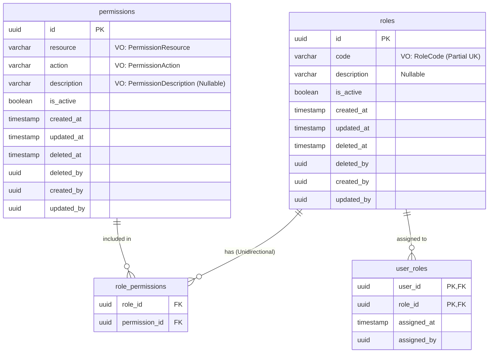
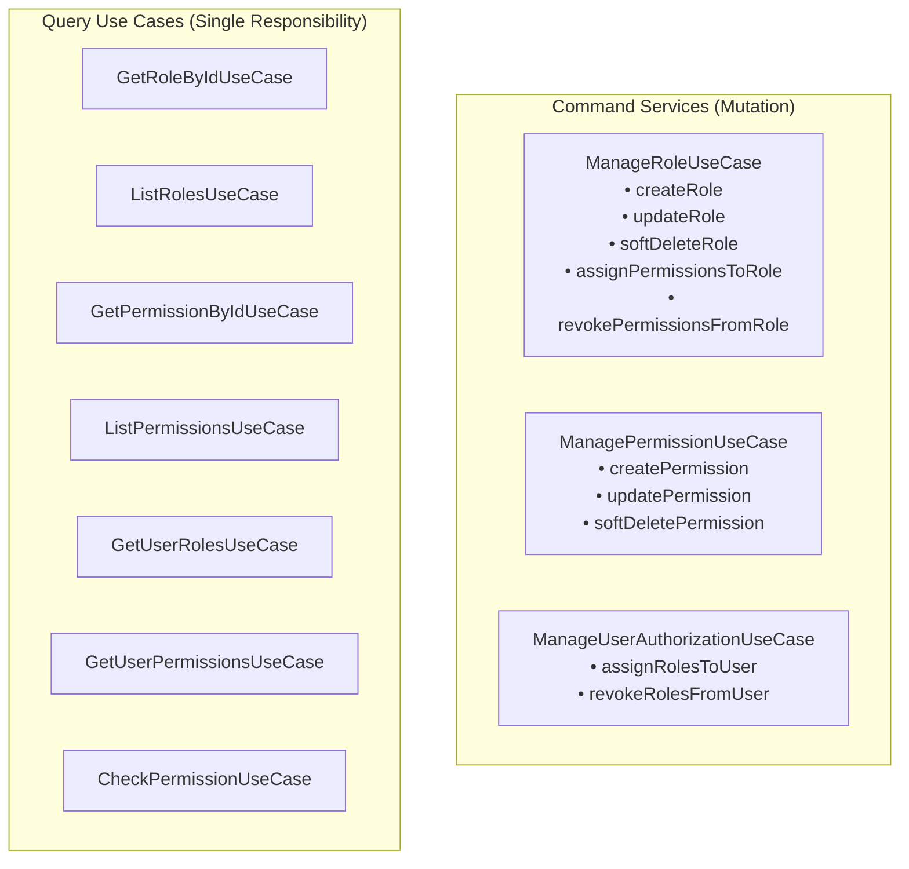
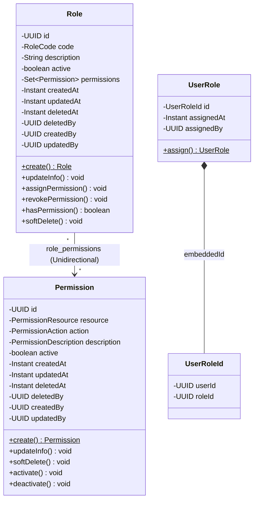

# 📐 Authorization Module V2 Architecture Design Document

**Date:** 2026-07-29  
**Status:** Approved  
**Target Module:** `authorization`  

---

## 📄 Executive Summary

Dự án VAOPS cần tái cấu trúc (refactor) toàn bộ module **Authorization** để khắc phục các vấn đề nghiêm trọng về cơ sở dữ liệu, quan hệ JPA, và mô hình Domain:
1. **Giải quyết xung đột dữ liệu `UserRole`**: Loại bỏ mô hình lai giữa Active State và Audit Log bằng cách chuyển `user_roles` thành Clean Join Table (Revoke = Hard Delete).
2. **Triệt tiêu quan hệ hai chiều `Role ⟷ Permission`**: Chuyển thành Unidirectional (`Role` -> `Set<Permission>`), xóa `Set<Role> roles` khỏi `Permission` để tránh Circular Dependency và nổ lỗi Cascade.
3. **Sửa lỗi Unique Constraint do Soft-Delete**: Thay thế Unique Constraint cứng trên `roles.code` và `permissions(resource, action)` bằng Partial Unique Indexes (`WHERE deleted_at IS NULL`).
4. **Nâng cấp từ Anemic Domain Model lên Rich Domain Model**: Đóng gói hoàn toàn state mutation vào domain methods, xóa bỏ class-level `@Setter`, xây dựng các Value Objects với `@Converter(autoApply = true)`.
5. **Chuẩn hóa Use Case Granularity (Từ 17 Use Cases -> 10 Use Cases)**: Gộp các Use Case mutation manh mún thành 3 Command Services (`ManageRoleUseCase`, `ManagePermissionUseCase`, `ManageUserAuthorizationUseCase`) và giữ nguyên 7 Query Use Cases riêng biệt chuẩn CQRS.

---

## 🛢️ 1. Database Schema & Flyway Migration (`V2__fix_authorization_schema.sql`)

### 1.1 Chi tiết File Migration `V2__fix_authorization_schema.sql`

```sql
-- ----------------------------------------------------------------------------
-- Migration: V2__fix_authorization_schema.sql
-- Description: Refactor user_roles join table & add partial unique indexes
-- ----------------------------------------------------------------------------

-- 1. Refactor user_roles table: Remove soft-delete tracking columns
ALTER TABLE user_roles DROP COLUMN IF EXISTS revoked_at;
ALTER TABLE user_roles DROP COLUMN IF EXISTS revoked_by;

-- 2. Refactor roles table: Drop legacy UK and create Partial Unique Index
ALTER TABLE roles DROP CONSTRAINT IF EXISTS roles_code_key;
DROP INDEX IF EXISTS uk_roles_code_active;
CREATE UNIQUE INDEX uk_roles_code_active ON roles (code) WHERE deleted_at IS NULL;

-- 3. Refactor permissions table: Drop legacy UK index and create Partial Unique Index
DROP INDEX IF EXISTS uk_permissions_action;
DROP INDEX IF EXISTS uk_permissions_action_active;
CREATE UNIQUE INDEX uk_permissions_action_active ON permissions (resource, action) WHERE deleted_at IS NULL;
```

### 1.2 ER Diagram Mới (Clean Join Table & Unique Partial Indexes)



---

## 💎 2. Rich Domain Model & Encapsulation Strategy

### 2.1 Quy tắc Đóng gói (Encapsulation Rules)
* **Xóa bỏ `@Setter` ở cấp độ Class** trên tất cả Entity (`Role`, `Permission`, `UserRole`).
* Chỉ cho phép `@Getter` và `@NoArgsConstructor(access = AccessLevel.PROTECTED)` để JPA khởi tạo.
* Expose mutation duy nhất qua **Domain Methods** có tên thể hiện rõ mục đích nghiệp vụ (Ubiquitous Language).
* `@Setter` chỉ được phép ở cấp độ field cho `id` nếu JPA yêu cầu.

### 2.2 Value Objects (Records) & Auto-Apply JPA Converters

Mỗi Value Object sẽ kiểm tra tính hợp lệ ngay tại constructor (invariant checking) và đi kèm một `AttributeConverter` tương ứng:

#### 1. `RoleCode`
```java
public record RoleCode(String value) {
  public RoleCode {
    if (value == null || value.isBlank()) {
      throw new ValidationException("Role code must not be null or blank");
    }
    value = value.strip().toUpperCase();
    if (value.length() > 256) {
      throw new ValidationException("Role code must not exceed 256 characters");
    }
  }
}
```
* **Converter**: `RoleCodeConverter implements AttributeConverter<RoleCode, String>` với `@Converter(autoApply = true)`.

#### 2. `PermissionResource`
```java
public record PermissionResource(String value) {
  public PermissionResource {
    if (value == null || value.isBlank()) {
      throw new ValidationException("Permission resource must not be null or blank");
    }
    value = value.strip().toUpperCase();
    if (value.length() > 256) {
      throw new ValidationException("Permission resource must not exceed 256 characters");
    }
  }
}
```
* **Converter**: `PermissionResourceConverter implements AttributeConverter<PermissionResource, String>` với `@Converter(autoApply = true)`.

#### 3. `PermissionAction`
```java
public record PermissionAction(String value) {
  public PermissionAction {
    if (value == null || value.isBlank()) {
      throw new ValidationException("Permission action must not be null or blank");
    }
    value = value.strip().toUpperCase();
    if (value.length() > 256) {
      throw new ValidationException("Permission action must not exceed 256 characters");
    }
  }
}
```
* **Converter**: `PermissionActionConverter implements AttributeConverter<PermissionAction, String>` với `@Converter(autoApply = true)`.

#### 4. `PermissionDescription` (Nullable Value Object)
```java
public record PermissionDescription(String value) {
  public PermissionDescription {
    if (value != null) {
      value = value.strip();
      if (value.length() > 1024) {
        throw new ValidationException("Permission description must not exceed 1024 characters");
      }
    }
  }
}
```
* **Converter**: `PermissionDescriptionConverter implements AttributeConverter<PermissionDescription, String>` với `@Converter(autoApply = true)`. Handle `null` an toàn.

---

### 2.3 Aggregate Root & Domain Entities Design

#### `Permission` Entity (Rich Entity)
```java
@Entity
@Table(name = "permissions")
@Getter
@NoArgsConstructor(access = AccessLevel.PROTECTED)
public class Permission {

  @Id
  @UuidGenerator
  private UUID id;

  @Column(name = "resource", nullable = false, length = 256)
  private PermissionResource resource;

  @Column(name = "action", nullable = false, length = 256)
  private PermissionAction action;

  @Column(name = "description", nullable = true, length = 1024)
  private PermissionDescription description;

  @Column(name = "is_active", nullable = false)
  private boolean active = true;

  @CreationTimestamp
  @Column(name = "created_at", nullable = false, updatable = false)
  private Instant createdAt;

  @UpdateTimestamp
  @Column(name = "updated_at", nullable = false)
  private Instant updatedAt;

  @Column(name = "deleted_at", nullable = true)
  private Instant deletedAt;

  @Column(name = "deleted_by", nullable = true)
  private UUID deletedBy;

  @Column(name = "created_by", nullable = true)
  private UUID createdBy;

  @Column(name = "updated_by", nullable = true)
  private UUID updatedBy;

  // Domain Factory
  public static Permission create(
      PermissionResource resource,
      PermissionAction action,
      PermissionDescription description,
      UUID createdBy) {
    Permission p = new Permission();
    p.resource = resource;
    p.action = action;
    p.description = description;
    p.createdBy = createdBy;
    p.active = true;
    return p;
  }

  // Domain Behaviors
  public void updateInfo(
      PermissionResource resource,
      PermissionAction action,
      PermissionDescription description,
      UUID updatedBy) {
    this.resource = resource;
    this.action = action;
    this.description = description;
    this.updatedBy = updatedBy;
  }

  public void softDelete(UUID deletedByUserId) {
    this.deletedAt = Instant.now();
    this.deletedBy = deletedByUserId;
    this.active = false;
  }

  public void activate() {
    this.active = true;
  }

  public void deactivate() {
    this.active = false;
  }
}
```

#### `Role` Entity (Aggregate Root - Unidirectional Many-to-Many)
```java
@Entity
@Table(name = "roles")
@Getter
@NoArgsConstructor(access = AccessLevel.PROTECTED)
public class Role {

  @Id
  @UuidGenerator
  private UUID id;

  @Column(name = "code", nullable = false, length = 256)
  private RoleCode code;

  @Column(name = "description", nullable = true, length = 1024)
  private String description;

  @Column(name = "is_active", nullable = false)
  private boolean active = true;

  @ManyToMany
  @JoinTable(
      name = "role_permissions",
      joinColumns = @JoinColumn(name = "role_id"),
      inverseJoinColumns = @JoinColumn(name = "permission_id")
  )
  private Set<Permission> permissions = new HashSet<>();

  @CreationTimestamp
  @Column(name = "created_at", nullable = false, updatable = false)
  private Instant createdAt;

  @UpdateTimestamp
  @Column(name = "updated_at", nullable = false)
  private Instant updatedAt;

  @Column(name = "deleted_at", nullable = true)
  private Instant deletedAt;

  @Column(name = "deleted_by", nullable = true)
  private UUID deletedBy;

  @Column(name = "created_by", nullable = true)
  private UUID createdBy;

  @Column(name = "updated_by", nullable = true)
  private UUID updatedBy;

  // Domain Factory
  public static Role create(RoleCode code, String description, UUID createdBy) {
    Role r = new Role();
    r.code = code;
    r.description = description;
    r.createdBy = createdBy;
    r.active = true;
    return r;
  }

  // Domain Behaviors
  public void updateInfo(RoleCode code, String description, UUID updatedBy) {
    this.code = code;
    this.description = description;
    this.updatedBy = updatedBy;
  }

  public void assignPermission(Permission permission) {
    if (permission != null && permission.isActive()) {
      this.permissions.add(permission);
    }
  }

  public void assignPermissions(Collection<Permission> newPermissions) {
    if (newPermissions != null) {
      newPermissions.stream()
          .filter(Permission::isActive)
          .forEach(this.permissions::add);
    }
  }

  public void revokePermission(Permission permission) {
    if (permission != null) {
      this.permissions.remove(permission);
    }
  }

  public void revokePermissions(Collection<Permission> permissionsToRevoke) {
    if (permissionsToRevoke != null) {
      this.permissions.removeAll(permissionsToRevoke);
    }
  }

  public boolean hasPermission(PermissionResource resource, PermissionAction action) {
    if (!this.active || this.deletedAt != null) return false;
    return this.permissions.stream()
        .anyMatch(p -> p.isActive() 
                    && p.getResource().equals(resource) 
                    && p.getAction().equals(action));
  }

  public void softDelete(UUID deletedByUserId) {
    this.deletedAt = Instant.now();
    this.deletedBy = deletedByUserId;
    this.active = false;
  }
}
```

#### `UserRole` Entity (Clean Join Entity)
```java
@Entity
@Table(name = "user_roles")
@Getter
@NoArgsConstructor(access = AccessLevel.PROTECTED)
public class UserRole {

  @EmbeddedId
  private UserRoleId id;

  @Column(name = "assigned_at", nullable = false)
  private Instant assignedAt;

  @Column(name = "assigned_by")
  private UUID assignedBy;

  public static UserRole assign(UUID userId, UUID roleId, UUID assignedBy) {
    UserRole ur = new UserRole();
    ur.id = new UserRoleId(userId, roleId);
    ur.assignedAt = Instant.now();
    ur.assignedBy = assignedBy;
    return ur;
  }
}
```

---

## 🎯 3. Application Layer & Use Case Granularity (10 Use Cases)

Thay vì 17 class Use Case thụ động, hệ thống chuẩn hóa còn **10 Use Cases**:

### 3.1 Core Command Use Cases (3 Aggregated Services)



1. **`ManageRoleUseCase`**:
   * `createRole(CreateRoleCommand command): RoleResponse`
   * `updateRole(UpdateRoleCommand command): RoleResponse`
   * `softDeleteRole(SoftDeleteRoleCommand command): void`
   * `assignPermissionsToRole(AssignPermissionToRoleCommand command): void`
   * `revokePermissionsFromRole(RevokePermissionFromRoleCommand command): void`

2. **`ManagePermissionUseCase`**:
   * `createPermission(CreatePermissionCommand command): PermissionResponse`
   * `updatePermission(UpdatePermissionCommand command): PermissionResponse`
   * `softDeletePermission(SoftDeletePermissionCommand command): void`

3. **`ManageUserAuthorizationUseCase`**:
   * `assignRolesToUser(AssignRoleToUserCommand command): void`
   * `revokeRolesFromUser(RevokeRoleFromUserCommand command): void`

### 3.2 Query Use Cases (7 Distinct CQRS Services)
4. `GetRoleByIdUseCase`
5. `ListRolesUseCase`
6. `GetPermissionByIdUseCase`
7. `ListPermissionsUseCase`
8. `GetUserRolesUseCase`
9. `GetUserPermissionsUseCase`
10. `CheckPermissionUseCase`

---

## 📊 4. Class Diagram & Architecture Mapping



---

## 🚫 5. Exception Handling & Error Strategy

* **Shared Exceptions**:
  * `ValidationException`: Bắn ra khi Value Object khởi tạo không hợp lệ hoặc DTO null/empty.
  * `ResourceNotFoundException`: Bắn ra khi tìm Role/Permission bằng ID không tồn tại hoặc đã bị delete.
  * `ResourceAlreadyExistsException`: Bắn ra khi trùng `RoleCode` hoặc `(PermissionResource, PermissionAction)` khi tạo mới.
* **Module Exception**:
  * `UnauthorizedException` (trong `authorization/api/exception`): Trả về lỗi khi `CheckPermissionUseCase` kiểm tra không đủ quyền truy cập.

---

## 🧪 6. Spec Self-Review Checklist

- [x] **Placeholder Scan**: Không có "TODO", "TBD" hay thông số mập mờ.
- [x] **Internal Consistency**: Schema Flyway SQL hoàn toàn tương thích với JPA Entity Mappings và Partial Unique Index logic.
- [x] **Scope Check**: Tải trọng refactoring chuẩn xác 10 Use Cases, chia tách rõ giữa Command & Query.
- [x] **Ambiguity Check**: Quy định rõ 100% về Value Objects, AttributeConverters, Encapsulation, và Hard Delete đối với `user_roles`.

---

## 🚀 7. Next Steps

1. Dev xem xét và phê duyệt file Spec thiết kế này tại `docs/superpowers/specs/2026-07-29-authorization-v2-refactoring-design.md`.
2. Chuyển sang bước tạo **Implementation Plan** thông qua `writing-plans` skill.
