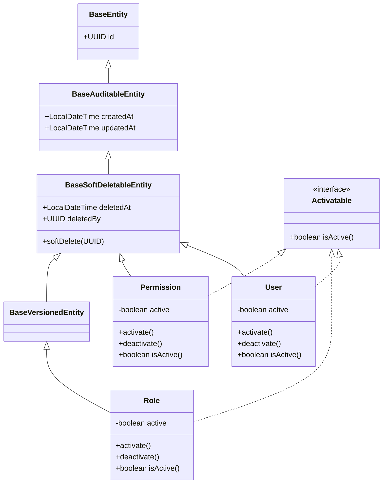

# Design Spec: Standardizing Soft Delete Query Skipping & Activatable Domain Interface

**Date**: 2026-07-31  
**Target Repository**: `vaops` (backend)  
**Status**: Draft for Review  

---

## 1. Overview & Goals

This design standardizes the handling of soft-deleted entities and domain status (`active`) across the application:
1. **Query Repositories**: Standard query methods (Tier 1) will explicitly filter out soft-deleted records (`WHERE deletedAt IS NULL`) using explicit JPQL queries.
2. **Domain Layer**: `BaseSoftDeletableEntity` no longer contains the `active` state or status methods (`activate()`, `deactivate()`). Entities that require an active status (`User`, `Role`, `Permission`) explicitly declare their `active` field, provide status methods, and implement the new `Activatable` interface.
3. **Security Gateways**: Use-cases (`LoginUseCase`, `RefreshTokenUseCase`, `CheckAvailableUserUseCase`) rely on standard query repositories skipping deleted records, and check entity status via the `Activatable` interface without needing `deletedAt` in DTOs or extra service checks.
4. **Maintenance Queries**: Specific maintenance/purge methods (Tier 3) use explicit JPQL queries with names containing `WithDeleted` (e.g. `findByIdWithDeleted`) to operate on soft-deleted entities during hard-delete procedures.

---

## 2. Architecture & Component Changes



### 2.1 Domain Layer Modifications

1. **`Activatable.java`** `[NEW]`
   - Package: `c4f.vannang.vaops.shared.base.domain`
   - Content:
     ```java
     package c4f.vannang.vaops.shared.base.domain;

     public interface Activatable {
       boolean isActive();
     }
     ```

2. **`BaseSoftDeletableEntity.java`** `[MODIFY]`
   - Remove `active` field, `@Column(name = "is_active")`, `activate()`, and `deactivate()`.
   - Update `softDelete(UUID)` to only set `deletedAt` and `deletedBy` (no longer sets `active = false`).

3. **`User.java`**, **`Role.java`**, **`Permission.java`** `[MODIFY]`
   - Implement `Activatable`.
   - Add field:
     ```java
     @Column(name = "is_active", nullable = false)
     private boolean active = true;
     ```
   - Add methods: `public boolean isActive()`, `public void activate()`, `public void deactivate()`.

---

## 3. Query Repository Tiering & JPQL Conventions

All Query Repositories will use **explicit JPQL queries** (`@Query(...)`) instead of Spring Data derived method names for clear intent and soft-delete filtering.

### 3.1 Tier Classification

| Tier | Purpose | JPQL Pattern | Example Methods |
|---|---|---|---|
| **Tier 1 (Standard)** | Normal application queries | `WHERE ... AND e.deletedAt IS NULL` | `findById`, `findByAccountName`, `findByCode`, `findAllByIdIn`, `existsByAccountName` |
| **Tier 2 (Active)** | Authorization & active domain reads | `WHERE ... AND e.active = true AND e.deletedAt IS NULL` | `findActiveById`, `findAllActiveByIdIn`, `findActiveByCode` |
| **Tier 3 (Maintenance)** | Hard-delete purge operations | `WHERE ...` (No `deletedAt` condition) | `findByIdWithDeleted`, `existsByIdWithDeleted` |

### 3.2 Detailed Repository Specifications

#### `UserQueryRepository`
- `findById(UUID id)`: `@Query("SELECT u FROM User u WHERE u.id = :id AND u.deletedAt IS NULL")`
- `findByAccountName(String accountName)`: `@Query("SELECT u FROM User u WHERE u.accountName = :accountName AND u.deletedAt IS NULL")`
- `findAllByIdIn(List<UUID> ids)`: `@Query("SELECT u FROM User u WHERE u.id IN :ids AND u.deletedAt IS NULL")`
- `existsByAccountName(String accountName)`: `@Query("SELECT COUNT(u) > 0 FROM User u WHERE u.accountName = :accountName AND u.deletedAt IS NULL")`
- `findByIdWithDeleted(UUID id)`: `@Query("SELECT u FROM User u WHERE u.id = :id")`

#### `RoleQueryRepository`
- `findById(UUID id)`: `@Query("SELECT r FROM Role r WHERE r.id = :id AND r.deletedAt IS NULL")`
- `findByCode(String code)`: `@Query("SELECT r FROM Role r WHERE r.code = :code AND r.deletedAt IS NULL")`
- `findAllByCodeIn(List<String> codes)`: `@Query("SELECT r FROM Role r WHERE r.code IN :codes AND r.deletedAt IS NULL")`
- `existsByCode(String code)`: `@Query("SELECT COUNT(r) > 0 FROM Role r WHERE r.code = :code AND r.deletedAt IS NULL")`
- `findAllByIdIn(List<UUID> ids)`: `@Query("SELECT r FROM Role r WHERE r.id IN :ids AND r.deletedAt IS NULL")`
- `findByIdWithDeleted(UUID id)`: `@Query("SELECT r FROM Role r WHERE r.id = :id")`
- `existsByIdWithDeleted(UUID id)`: `@Query("SELECT COUNT(r) > 0 FROM Role r WHERE r.id = :id")`

#### `PermissionQueryRepository`
- `findById(UUID id)`: `@Query("SELECT p FROM Permission p WHERE p.id = :id AND p.deletedAt IS NULL")`
- `findByResourceAndAction(String resource, String action)`: `@Query("SELECT p FROM Permission p WHERE p.resource = :resource AND p.action = :action AND p.deletedAt IS NULL")`
- `findAllByIdIn(List<UUID> ids)`: `@Query("SELECT p FROM Permission p WHERE p.id IN :ids AND p.deletedAt IS NULL")`
- `existsByResourceAndAction(String resource, String action)`: `@Query("SELECT COUNT(p) > 0 FROM Permission p WHERE p.resource = :resource AND p.action = :action AND p.deletedAt IS NULL")`
- `findByIdWithDeleted(UUID id)`: `@Query("SELECT p FROM Permission p WHERE p.id = :id")`
- `existsByIdWithDeleted(UUID id)`: `@Query("SELECT COUNT(p) > 0 FROM Permission p WHERE p.id = :id")`

---

## 4. Service Layer Adjustments

1. **`RoleService`**:
   - `hardDeleteRole`: Change lookup call from `findById` to `findByIdWithDeleted` so soft-deleted roles can be retrieved for purging.
   - `assignPermissionsToRole` & `unassignPermissionsFromRole`: Change query from `findAllByIdIn` to `findAllActiveByIdIn` (Tier 2) to ensure only active, non-deleted permissions can be assigned/unassigned.

2. **`PermissionService`**:
   - `hardDeletePermission`: Change lookup call from `findById` to `findByIdWithDeleted` so soft-deleted permissions can be retrieved for purging.

3. **`UserRoleService`**:
   - Retains current usage of `findAllActiveByIdIn` for assigning roles to users.

4. **Security & Authentication Use-Cases**:
   - `LoginUseCase`, `RefreshTokenUseCase`, `CheckAvailableUserUseCase`: Keep logic intact. Rely on query filtering out soft-deleted entities and `user.isActive()` / `role.isActive()` check via `Activatable`.

---

## 5. Database & Uniqueness Strategy

- No database migration script required for V1 schema.
- Database full UNIQUE constraints (e.g. `uq_users_account_name`) remain untouched.
- If a soft-deleted record exists with `account_name = 'userA'`, attempting to register a new user with `account_name = 'userA'` will be rejected by the database unique constraint as expected for full unique index schemas.

---

## 6. Verification & Test Plan

1. **Unit Tests**:
   - Run existing unit test suites (`UserTest`, `RoleTest`, `PermissionTest`).
   - Run Use-case tests (`LoginUseCaseTest`, `RefreshTokenUseCaseTest`, `SoftDeleteUseCaseTest`, `RegisterUseCaseTest`, `ToggleStatusUseCaseTest`).
   - Add/update tests verifying that soft-deleted entities return empty on standard `findById`/`findByAccountName`, but are accessible via `findByIdWithDeleted`.
2. **Build Verification**:
   - Run `./gradlew test` (or `./mvnw test`) to ensure clean compilation and test execution across all modules.

---
